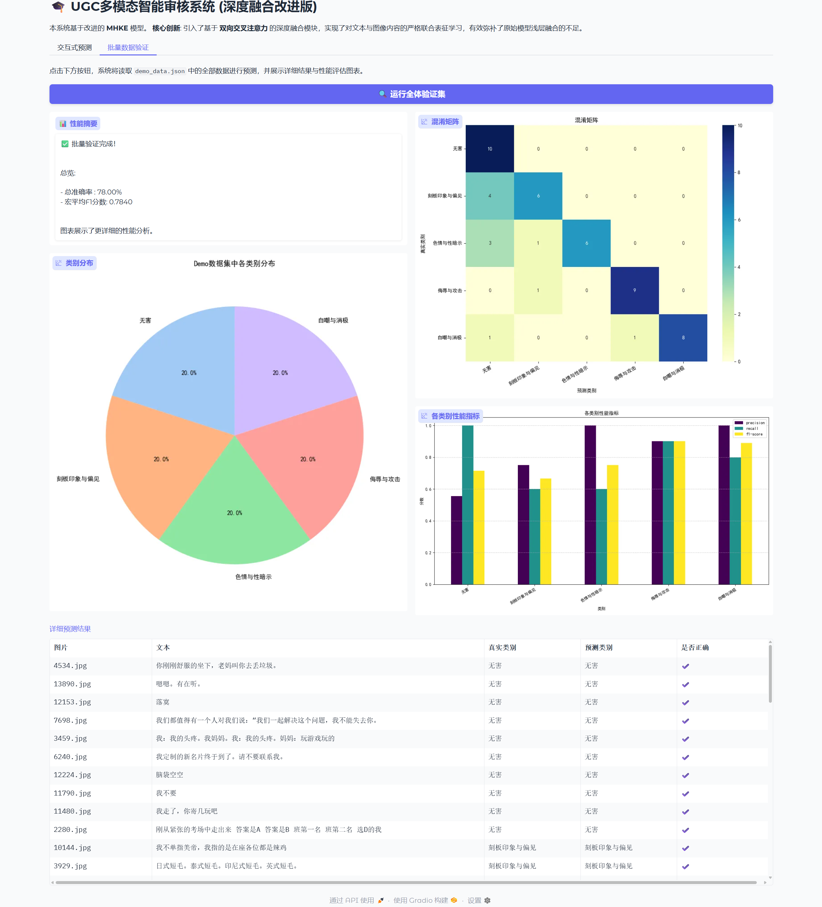

# 基于深度融合的中文有害Meme检测系统

本项目是对 [DUT-lujunyu/ToxiCN_MM](https://github.com/DUT-lujunyu/ToxiCN_MM) 项目的改进与增强。

## 核心贡献

在 `ToxiCN_MM` 原有的 **MHKE (多模态知识增强)** 模型基础上，我们进行了以下核心改进：

1.  **引入深度融合机制**:
    -   将原始模型简单的**特征拼接 (Concatenation)** 策略，升级为基于 **双向交叉注意力 (Bi-directional Cross-Attention)** 的深度融合模块。
    -   这使得模型能够实现对文本和图像特征的早期交互与深度融合，更有效地捕捉跨模态的复杂语义关联，解决了原模型融合层次较浅的问题。

2.  **增强的可视化展示**:
    -   我们使用 **Gradio** 构建了一个交互式的Web界面 (`app.py`)，用于直观地展示模型的预测能力。
    -   演示系统不仅支持对单个Meme的实时预测，还提供了一键式的**批量验证**功能，能够自动在测试集上运行并生成包括**混淆矩阵**、**各类别性能指标图**在内的多维度性能分析报告。

## 快速开始

1.  **环境配置**:
    ```bash
    pip install -r requirements.txt
    ```

2.  **运行演示系统**:
    ```bash
    python app.py
    ```
    在浏览器中打开提供的本地或公网链接即可访问。
    
## 系统功能概览

**交互式预测界面**
*   支持用户上传图片和输入文本，实时获取模型的分类结果与置信度。


**批量评估与分析界面**
*   一键在测试集上运行批量预测，并自动生成专业的性能分析图表，包括混淆矩阵、各类别P/R/F1分数等。


## 致谢

感谢 [ToxiCN_MM](https://github.com/DUT-lujunyu/ToxiCN_MM) 的作者们提供了出色的基线工作和数据集。
